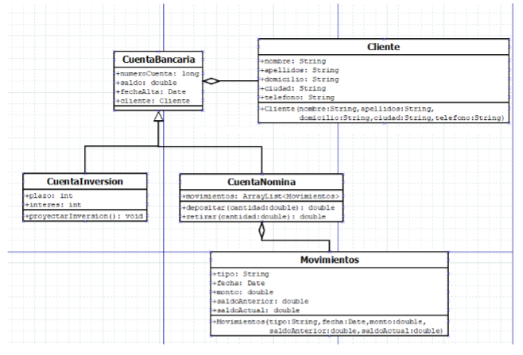

**NOMBRE** : JUAN ALBERTO ARVIZU CASTILLO  
**SEMESTRE** : 2do Semestre 
**CARRERA** : INGENIERIA EN SISTEMAS COMPUTACIONALES

## Introduccion

En esta ocasión, nos sumergiremos en el diseño y desarrollo de un sistema financiero en Java. Este proyecto tiene como objetivo la creación de un sistema completo que gestione cuentas bancarias, movimientos de dinero, inversiones y nóminas.

### Indice

1. Teoría
2. Desarrollo  
2.1. Enunciado   
2.2 Diagrama de Flujo   
2.3 Diagrama de Clases   
2.4 Código   
2.5 Pruebas Funcionales
3. Conclusiones
4. Bibliografía

## Teoria
#### Conceptos
 

##### Encapsulamiento:

Es el mecanismo que permite ocultar la implementación interna de un objeto y restringir el acceso a sus datos, solo permitiendo interactuar con ellos a través de métodos específicos.

##### Herencia:
Permite a una clase heredar atributos y métodos de otra clase. Esto fomenta la reutilización de código y la organización jerárquica de las clases.

##### Polimorfismo:

Permite que objetos de diferentes clases respondan al mismo mensaje, comportándose de manera distinta según su tipo.

##### extends:

Es un operador en Java que se utiliza para verificar si un objeto es una instancia de una clase, una subclase o una interfaz. Retorna true si el objeto es una instancia del tipo especificado o de una de sus subclases, y false en caso contrario.

##### FileReader:

FileReader es una clase en Java que se utiliza para leer datos de un archivo de texto. Se utiliza principalmente para leer datos de archivos de texto de manera secuencial, caracter por caracter o en bloques de caracteres. FileReader se utiliza en conjunto con otras clases como BufferedReader para mejorar la eficiencia de lectura.

##### FileWriter

FileWriter es una clase en Java que se utiliza para escribir datos en un archivo de texto. Se utiliza principalmente para escribir datos de manera secuencial en un archivo de texto. FileWriter se utiliza en conjunto con otras clases como BufferedWriter para mejorar la eficiencia de escritura.

##### File

File es una clase en Java que representa un archivo o directorio en el sistema de archivos. Se utiliza para realizar operaciones como crear, eliminar, renombrar o verificar la existencia de archivos o directorios en el sistema. La clase File proporciona métodos para obtener información sobre el archivo o directorio, como su nombre, ruta, tamaño y permisos.

## Desarrollo

#### Enunciado

El objetivo es diseñar y programar un sistema en Java capaz de administrar cuentas bancarias, movimientos de dinero, inversiones y nóminas. El sistema debe ser eficiente, confiable y fácil de usar para los usuarios finales. Al finalizar el proyecto, se espera obtener una solución funcional que satisfaga las necesidades del mundo financiero actual.

#### Diagrama de Clases

Fuente: `Desarrollada por su servilleta`

#### Diagrama de Flujo

Fuente: `de los deseos`

### Pruebas Funcionales
##### Recurso 1.0

##### Recurso 1.1

##### Recurso 1.2

##### Recurso 1.3

### CODIGOS

#### Conclusiones

En el desarrollo de esta práctica, logre medio entender y creo que tambien supe usar o aplicar los conceptos de herencia, polimorfismo y extends y todo lo relacionado a File. `(Que esten bien usados es otra cosa JAJAJAJ)` La creacion del menu es la que facilitara la interacción con el usuario y permitira una mejor comprension y funcionamiento del programa o script.

#### Bibliografia

> Ejemplo Java FileWriter.    <cite>[digitalocean](https://www.digitalocean.com/community/tutorials/java-filewriter-example)</cite>

> Documentacion de Java (Extends)   <cite>[developer.mozilla](https://developer.mozilla.org/es/docs/Web/JavaScript/Reference/Classes/extends)</cite>

> Using BufferedReader to read Text File   <cite>[stackoverflow](https://stackoverflow.com/questions/16104616/using-bufferedreader-to-read-text-file)</cite>

