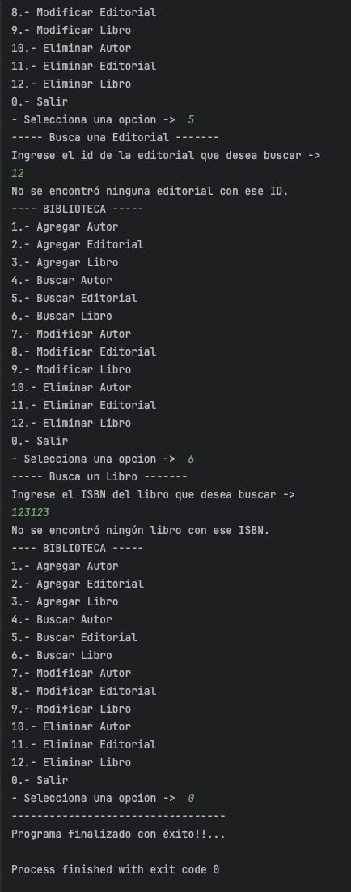
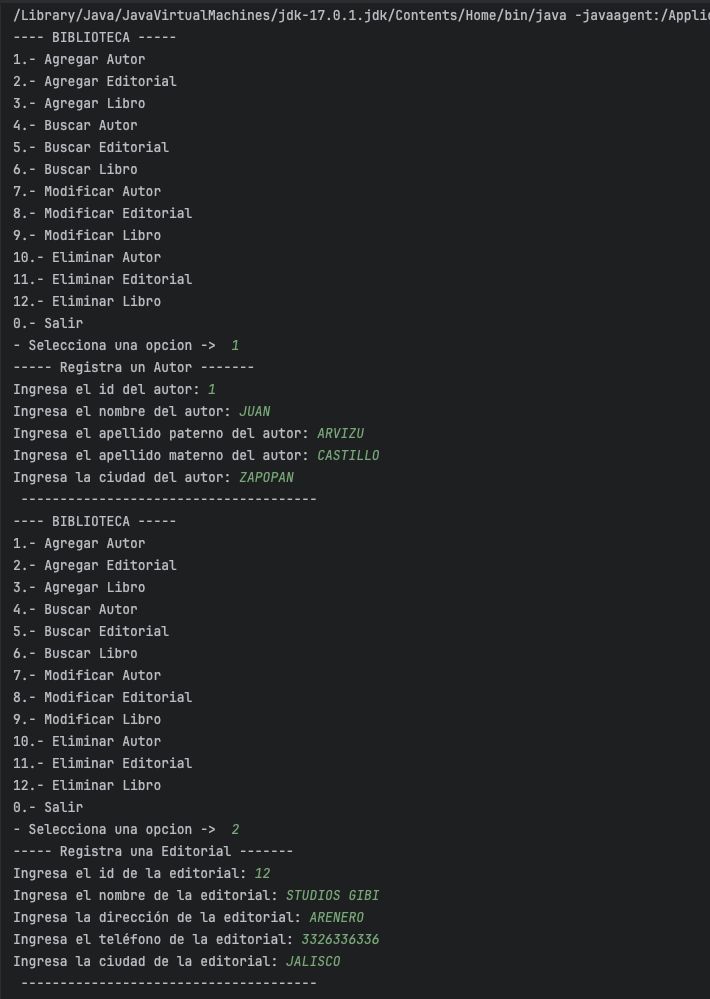
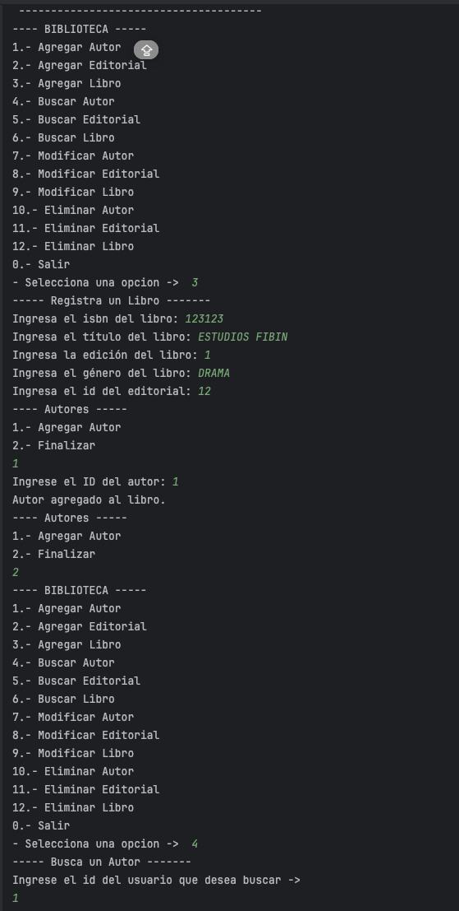
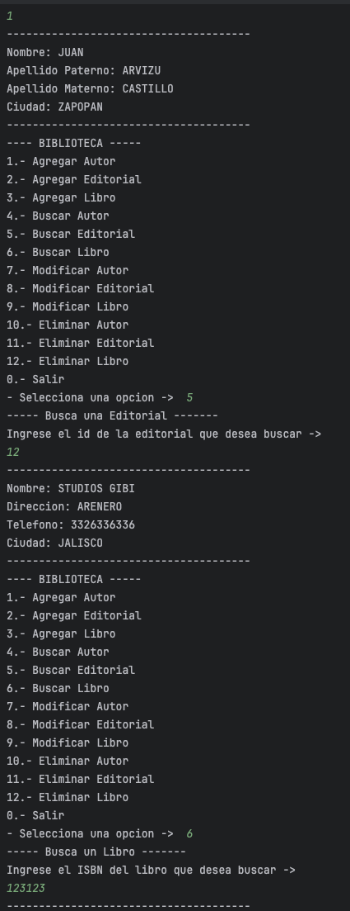
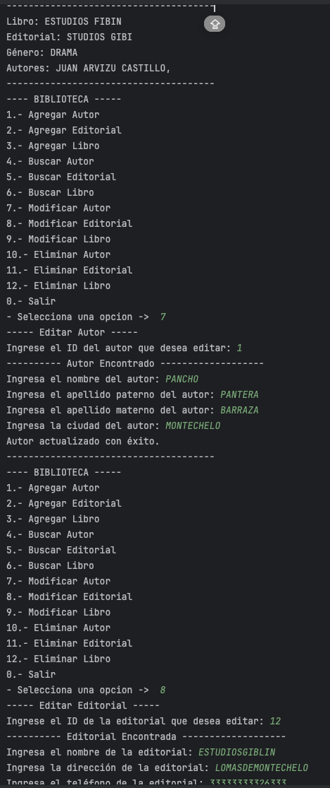
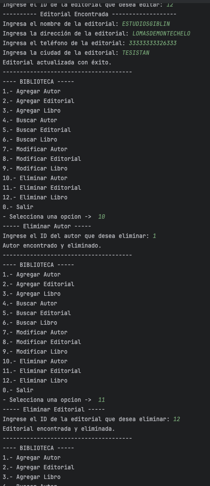
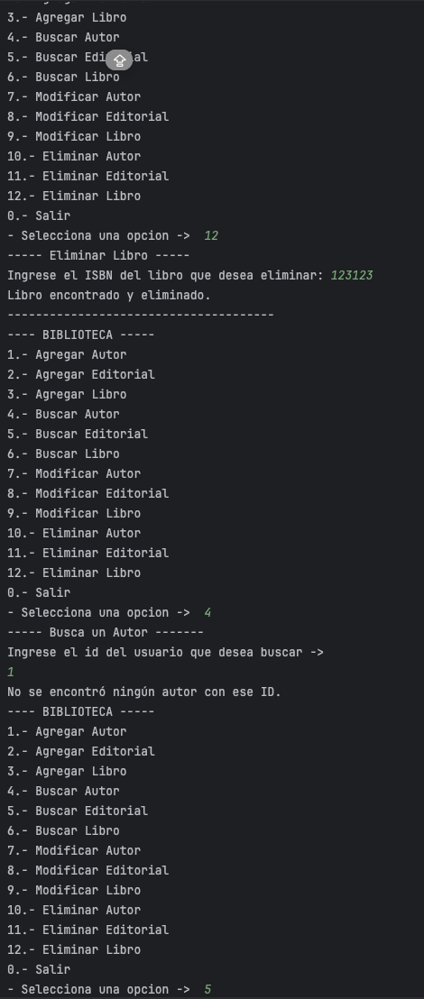

**NOMBRE** : JUAN ALBERTO ARVIZU CASTILLO  
**SEMESTRE** : 2do Semestre 
**CARRERA** : INGENIERIA EN SISTEMAS COMPUTACIONALES

## Introduccion

Esta práctica se enfoca en crear e implementar tres clases principales: Editorial, Libro y Autor, con el objetivo de manejar datos de bibliotecas de manera eficiente.

La clase Autor incluye atributos como ids, nombres y ciudad. La clase Editorial almacena información sobre las editoriales, como nombre, dirección y domicilio. La clase Libro representa a un libro, con atributos como título, género y autor(es).

Para gestionar estas entidades, se ha diseñado un menú interactivo que permite agregar, buscar, modificar y eliminar autores, editoriales y libros. Esto facilita la administración y organización de la información bibliográfica.

### Indice

1. Teoría
2. Desarrollo  
2.1. Enunciado   
2.2 Diagrama de Flujo   
2.3 Diagrama de Clases   
2.4 Código   
2.5 Pruebas Funcionales
3. Conclusiones
4. Bibliografía

## Teoria
#### Conceptos
 

##### Encapsulamiento:

Es el mecanismo que permite ocultar la implementación interna de un objeto y restringir el acceso a sus datos, solo permitiendo interactuar con ellos a través de métodos específicos.

##### Herencia:
Permite a una clase heredar atributos y métodos de otra clase. Esto fomenta la reutilización de código y la organización jerárquica de las clases.

##### ArrayList:

Permite almacenar datos en memoria de forma similar a los Arrays, con la ventaja de que el numero de elementos que almacena, lo hace de forma dinámica.

## Desarrollo

#### Enunciado

En esta práctica, se solicita diseñar e implementar dos clases en Java: Persona y FileManager, para facilitar la gestión de información personal de usuarios en una aplicación. La clase Persona contendrá los datos básicos de cada individuo, mientras que la clase FileManager se encargará de manejar la lectura y escritura de estos datos en un archivo, así como de proporcionar funcionalidades adicionales para la manipulación de usuarios.

El objetivo principal de esta práctica es comprender los conceptos de encapsulamiento, composición y persistencia de datos en el contexto de la programación orientada a objetos. Para ello, se deberá implementar adecuadamente el diseño propuesto, asegurando la correcta definición de atributos, métodos y relaciones entre las clases.

Se espera que al finalizar la práctica, se haya obtenido un programa funcional que permita almacenar, modificar y eliminar datos de usuarios de manera eficiente, demostrando así la comprensión de los conceptos y técnicas involucradas en el desarrollo de software orientado a objetos y la manipulación de archivos en Java.

#### Diagrama de Clases

Fuente: `Desarrollada por su servilleta`

#### Diagrama de Flujo

Fuente: `de los deseos`

### Pruebas Funcionales
##### Recurso 1.0

##### Recurso 1.1

##### Recurso 1.2

##### Recurso 1.3

##### Recurso 1.4

##### Recurso 1.5

##### Recurso 1.6

### CODIGOS

#### Conclusiones

En el desarrollo de esta práctica, logre medio entender y creo que tambien supe usar o aplicar los conceptos de herencia y extends y cosas sobre ArrayList como el agregar, eliminar y manipular los datos dentro de ella a base de poo. `(Que esten bien usados es otra cosa JAJAJAJ)` La creacion del menu es la que facilitara la interacción con el usuario y permitira una mejor comprension y funcionamiento del programa o script.

#### Bibliografia

> Ejemplo Java ArrayList.    <cite>[w3schools](https://www.w3schools.com/java/java_arraylist.asp)</cite>

