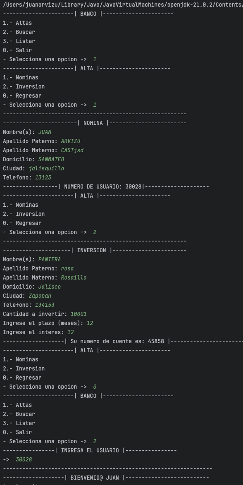
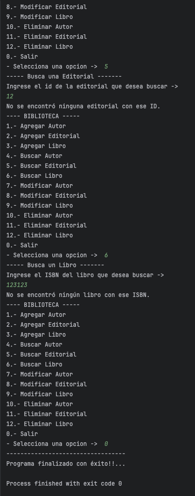

**NOMBRE** : JUAN ALBERTO ARVIZU CASTILLO  
**SEMESTRE** : 2do Semestre 
**CARRERA** : INGENIERIA EN SISTEMAS COMPUTACIONALES

## Introduccion

En el mundo del desarrollo de software, la creación y gestión de datos de usuarios es una tarea fundamental en numerosas aplicaciones. La presente práctica se enfoca en el diseño e implementación de dos clases clave: Persona y FileManager, con el objetivo de gestionar información personal y facilitar su almacenamiento y manipulación en archivos.

La clase Persona define los atributos y métodos necesarios para representar a un individuo, incluyendo su identificación, nombre, apellidos y ciudad de residencia. Por otro lado, la clase FileManager se encarga de manejar la lectura y escritura de datos de personas en un archivo, así como de proporcionar funcionalidades para agregar, modificar y eliminar usuarios.

Este reporte detallará el diseño de las clases mencionadas, explicando sus atributos, métodos y relaciones, así como su implementación en un escenario práctico.

### Indice

1. Teoría
2. Desarrollo  
2.1. Enunciado   
2.2 Diagrama de Flujo   
2.3 Diagrama de Clases   
2.4 Código   
2.5 Pruebas Funcionales
3. Conclusiones
4. Bibliografía

## Teoria
#### Conceptos
 

##### Encapsulamiento:

Es el mecanismo que permite ocultar la implementación interna de un objeto y restringir el acceso a sus datos, solo permitiendo interactuar con ellos a través de métodos específicos.

##### Herencia:
Permite a una clase heredar atributos y métodos de otra clase. Esto fomenta la reutilización de código y la organización jerárquica de las clases.

##### Polimorfismo:

Permite que objetos de diferentes clases respondan al mismo mensaje, comportándose de manera distinta según su tipo.

##### extends:

Es un operador en Java que se utiliza para verificar si un objeto es una instancia de una clase, una subclase o una interfaz. Retorna true si el objeto es una instancia del tipo especificado o de una de sus subclases, y false en caso contrario.

## Desarrollo

#### Enunciado

En esta práctica, se solicita diseñar e implementar dos clases en Java: Persona y FileManager, para facilitar la gestión de información personal de usuarios en una aplicación. La clase Persona contendrá los datos básicos de cada individuo, mientras que la clase FileManager se encargará de manejar la lectura y escritura de estos datos en un archivo, así como de proporcionar funcionalidades adicionales para la manipulación de usuarios.

El objetivo principal de esta práctica es comprender los conceptos de encapsulamiento, composición y persistencia de datos en el contexto de la programación orientada a objetos. Para ello, se deberá implementar adecuadamente el diseño propuesto, asegurando la correcta definición de atributos, métodos y relaciones entre las clases.

Se espera que al finalizar la práctica, se haya obtenido un programa funcional que permita almacenar, modificar y eliminar datos de usuarios de manera eficiente, demostrando así la comprensión de los conceptos y técnicas involucradas en el desarrollo de software orientado a objetos y la manipulación de archivos en Java.

#### Diagrama de Clases

Fuente: `Desarrollada por su servilleta`

#### Diagrama de Flujo

Fuente: `de los deseos`

### Pruebas Funcionales
##### Recurso 1.0

##### Recurso 1.1

##### Recurso 1.2

### CODIGOS

#### Conclusiones

En el desarrollo de esta práctica, logre medio entender y creo que tambien supe usar o aplicar los conceptos de herencia, polimorfismo y extends y todo lo relacionado a File. `(Que esten bien usados es otra cosa JAJAJAJ)` La creacion del menu es la que facilitara la interacción con el usuario y permitira una mejor comprension y funcionamiento del programa o script.

#### Bibliografia

> Ejemplo Java FileWriter.    <cite>[digitalocean](https://www.digitalocean.com/community/tutorials/java-filewriter-example)</cite>

> Documentacion de Java (Extends)   <cite>[developer.mozilla](https://developer.mozilla.org/es/docs/Web/JavaScript/Reference/Classes/extends)</cite>

> Using BufferedReader to read Text File   <cite>[stackoverflow](https://stackoverflow.com/questions/16104616/using-bufferedreader-to-read-text-file)</cite>
